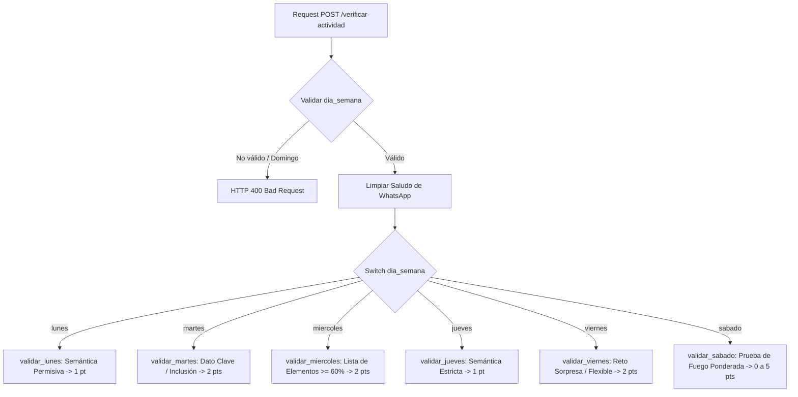

# Manual de Operación: Endpoint `POST /verificar-actividad` (Motor RAG)

Este documento sirve como manual técnico de referencia para el endpoint `POST /verificar-actividad`, el cual evalúa los retos bíblicos diarios enviados por los usuarios a través del Bot de WhatsApp (n8n + Supabase).

---

## 1. 🎯 Propósito del Endpoint

El endpoint **`POST /verificar-actividad`** recibe de forma explícita el día de la semana y los textos del reto diario (`pregunta`, `respuesta_esperada` y `respuesta_usuario`). 

A diferencia del endpoint de lectura bíblica (`/verificar-lectura`), este endpoint no consulta las lecturas de la base de datos ni infiere el día; ejecuta una lógica de validación semántica y difusa calibrada específicamente según la actividad de cada día de la semana, devolviendo el veredicto y el puntaje directo listo para ser guardado en la tabla `puntajes` de Supabase por el workflow de n8n.

---

## 2. 🔌 Especificación de la API

- **Ruta**: `POST /verificar-actividad`
- **Headers**: `Content-Type: application/json`

### Request Body (JSON):
```json
{
  "actividad": "pregunta_aplicacion | detective_biblico | reto_20_segundos | completa_idea | reto_sorpresa | prueba_fuego",
  "pregunta": "string - la pregunta_reto del día (de la tabla lecturas_diarias)",
  "respuesta_esperada": "string - la respuesta_esperada guardada en la BD para ese día",
  "respuesta_usuario": "string - el texto que envió el usuario por WhatsApp"
}
```

### Response Body (JSON - HTTP 200 OK):
```json
{
  "veredicto": "valido | invalido",
  "similitud": 0.85,
  "puntos": 2,
  "explicacion": "string explicativo del veredicto y elementos evaluados"
}
```

### Respuesta de Error (HTTP 400 Bad Request):
Se activa si la actividad recibida no está entre los tipos habilitados (ejemplo: `"actividad_inexistente"`):
```json
{
  "detail": "Tipo de actividad 'actividad_inexistente' no es válido. Opciones válidas: pregunta_aplicacion, detective_biblico, reto_20_segundos, completa_idea, reto_sorpresa, prueba_fuego."
}
```

---

## 3. 🧹 Limpieza Automática de Saludos (WhatsApp)

Antes de realizar la validación, el sistema ejecuta la función `limpiar_saludo_actividad(texto)` que remueve expresiones conversacionales comunes enviadas en WhatsApp, aislando el contenido real de la respuesta.

### Frases limpiadas automáticamente:
- *"Hola grupo buenos días, la respuesta es..."* ➔ *"..."*
- *"Buenas tardes hermano, la respuesta al reto de hoy es..."* ➔ *"..."*
- *"Bendiciones a todos, mis respuestas son..."* ➔ *"..."*
- *"Amén hermanos,..."* ➔ *"..."*

---

## 4. 🧠 Lógica de Validación por Día de la Semana



### 🗓️ Lunes — "Pregunta / aplicación"
- **Puntuación**: Binaria (**1 pt** si válido, **0 pts** si inválido).
- **Lógica**: Comparación semántica mediante embeddings multilingües e5 (`multilingual-e5-small`) y similitud de tokens (`rapidfuzz`).
- **Criterio**: Acepta sinónimos y reflexiones personales que capturen la idea central con un umbral permisivo ($\ge 0.65$).

### 🕵️ Martes — "Detective bíblico"
- **Puntuación**: Binaria (**2 pts** si válido, **0 pts** si inválido).
- **Lógica**: Busca la presencia de un dato puntual específico (un nombre, lugar, número o fecha).
- **Criterio**: Verifica la inclusión directa o coincidencia estricta de palabras clave principales del dato esperado ($\ge 0.78$ o coincidencia de palabra clave).

### ⚡ Miércoles — "Reto de 20 segundos"
- **Puntuación**: Binaria (**2 pts** si válido, **0 pts** si inválido).
- **Lógica**: Extrae los ítems de `respuesta_esperada` (separados por comas, `;` o `y`) y valida cuántos están presentes en `respuesta_usuario`.
- **Criterio**: Requiere que se mencionen al menos el **60%** de los elementos requeridos ($\ge \lceil \text{total} \times 0.6 \rceil$). *El control de horario (21:00–21:05) es gestionado previamente por n8n.*

### 🧩 Jueves — "Completa la idea"
- **Puntuación**: Binaria (**1 pt** si válido, **0 pts** si inválido).
- **Lógica**: Comparación semántica entre la frase del usuario y la frase/versículo esperado.
- **Criterio**: Requiere una precisión más alta que la del lunes ($\ge 0.72$).

### 🎁 Viernes — "Reto sorpresa"
- **Puntuación**: Binaria (**2 pts** si válido, **0 pts** si inválido).
- **Lógica**: Evaluación flexible semántica y difusa para formatos variables.
- **Criterio**: Umbral permisivo ($\ge 0.65$).

### 🔥 Sábado — "Prueba de fuego" (Ponderado)
- **Puntuación**: Variable (**0 a 5 puntos**).
- **Lógica**: Divide la `respuesta_esperada` en sus puntos clave (viñetas, números o frases), mide la cobertura de ítems alcanzada por el usuario y calcula un `score` ponderado entre 0.0 y 1.0.
- **Escala de Conversión a Puntos**:
  - `score >= 0.90` ➔ **5 puntos**
  - `score >= 0.70` ➔ **4 puntos**
  - `score >= 0.50` ➔ **3 puntos**
  - `score >= 0.30` ➔ **2 puntos**
  - `score >= 0.10` ➔ **1 punto**
  - `score <  0.10` ➔ **0 puntos**
- **Veredicto**: `"valido"` si puntos $> 0$, `"invalido"` si puntos $= 0$.
- **Explicación**: Detalla explícitamente cuáles puntos fueron cubiertos y cuáles faltaron.

---

## 5. 🛠️ Estructura del Código

El motor se organiza en los siguientes archivos clave dentro de `rag-server/`:

- **[`app/actividades.py`](file:///Users/luchoflow/Downloads/PROYECTO%20WHATSSAP%20IPUIE/rag-server/app/actividades.py)**: Módulo principal con la lógica de limpieza de saludos, extracción de listas, funciones de similitud combinada y validadores por día.
- **[`app/main.py`](file:///Users/luchoflow/Downloads/PROYECTO%20WHATSSAP%20IPUIE/rag-server/app/main.py)**: Define las rutas FastAPI (`/verificar-actividad`, `/verificar-lectura`, `/salud`) y maneja las respuestas Pydantic y errores HTTP 400.
- **[`test_actividades.py`](file:///Users/luchoflow/Downloads/PROYECTO%20WHATSSAP%20IPUIE/rag-server/test_actividades.py)**: Suite de pruebas de integración con `FastAPI TestClient`.

---

## 🧪 6. Ejecución de Pruebas Unitarias

Para ejecutar las pruebas del endpoint:

```bash
cd rag-server
./venv/bin/python -m unittest test_actividades.py -v
```

Todas las 13 pruebas pasan exitosamente en menos de 11 segundos.
