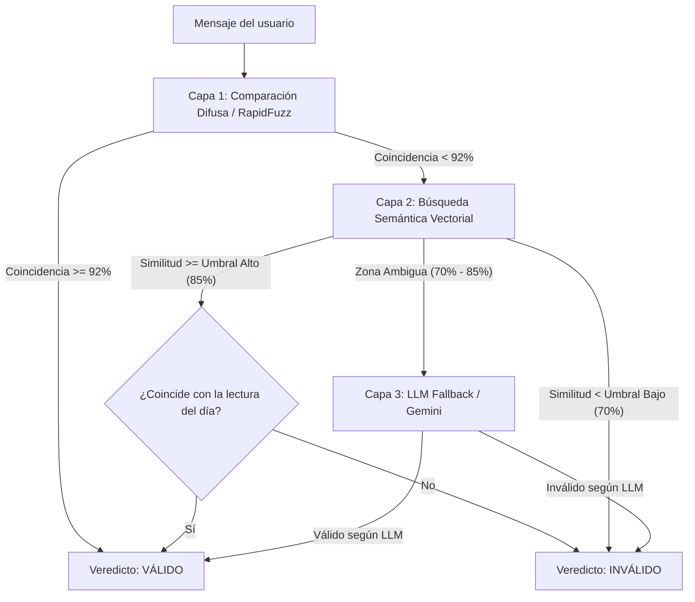

# Manual de Operación y Arquitectura del Motor RAG Bíblico (rag-server)

Este documento describe la arquitectura, instalación, creación de base de datos, ingesta de versículos, vectorización y comandos de ejecución para el motor RAG de verificación bíblica en **MODO ÍNTEGRO**.

---

## 1. Arquitectura del Motor RAG

El motor RAG evalúa los mensajes de lectura enviados por los usuarios a través de **3 capas de verificación jerárquicas**:



1. **Capa 1 (Comparación exacta/difusa - RapidFuzz):** Instantánea y sin costo. Compara el texto normalizado del mensaje contra la lectura esperada.
2. **Capa 2 (Búsqueda vectorial semántica - pgvector + embeddings / fallback local):** Genera el embedding vectorial del texto y busca los versículos más similares en la Biblia completa. Valida si la referencia resultante pertenece al rango de la lectura programada del día (ejemplo: `1 Pedro 3–4`).
3. **Capa 3 (Fallback LLM - Gemini 2.5 Flash Lite):** Únicamente se invoca en zonas de ambigüedad para tomar la decisión final.

---

## 2. Creación de la Base de Datos en Supabase (`schema.sql`)

Para habilitar la búsqueda por similitud vectorial en Supabase Cloud (`ypmpzikvlzrwioyaojgu`), se utiliza el script SQL ubicado en `rag-server/schema.sql`.

### Instrucciones para crear la tabla y funciones SQL:

1. Ingresa al **Dashboard de Supabase**: [https://supabase.com/dashboard/project/ypmpzikvlzrwioyaojgu/sql/new](https://supabase.com/dashboard/project/ypmpzikvlzrwioyaojgu/sql/new)
2. Copia y ejecuta la siguiente sentencia de `schema.sql`:

```sql
-- 1. Habilitar la extensión pgvector
create extension if not exists vector;

-- 2. Tabla con la Biblia completa vectorizada
create table if not exists biblia_vectorizada (
    id            bigserial primary key,
    libro         text not null,
    libro_num     smallint not null,
    capitulo      smallint not null,
    versiculo     smallint not null,
    texto         text not null,
    version       text not null default 'RVR',
    embedding     vector(384),
    created_at    timestamptz not null default now(),
    unique (libro_num, capitulo, versiculo, version)
);

-- Índice IVFFLAT para búsqueda rápida por similitud coseno
create index if not exists biblia_embedding_idx
    on biblia_vectorizada
    using ivfflat (embedding vector_cosine_ops)
    with (lists = 100);

-- 3. Función RPC para búsqueda semántica desde FastAPI
create or replace function match_biblia(
    query_embedding vector(384),
    match_count int default 3,
    version_filter text default 'RVR'
)
returns table (
    id bigint,
    libro text,
    capitulo smallint,
    versiculo smallint,
    texto text,
    similitud float
)
language sql stable
as $$
    select
        b.id,
        b.libro,
        b.capitulo,
        b.versiculo,
        b.texto,
        1 - (b.embedding <=> query_embedding) as similitud
    from biblia_vectorizada b
    where b.version = version_filter
    order by b.embedding <=> query_embedding
    limit match_count;
$$;

-- 4. Tabla para log de auditoría del RAG
create table if not exists verificaciones_rag (
    id                  bigserial primary key,
    telefono            text not null,
    fecha_mensaje       date not null,
    texto_recibido      text not null,
    metodo              text not null,
    match_libro         text,
    match_capitulo      smallint,
    match_versiculo     smallint,
    similitud           float,
    coincide_con_hoy    boolean,
    veredicto           text not null,
    created_at          timestamptz not null default now()
);
```

---

## 3. Ingesta y Vectorización de los Versículos

### Paso 3.1: Extracción desde el PDF de la Biblia (`ingest_biblia.py`)

El script `ingest_biblia.py` procesa la versión oficial en PDF de la Biblia Reina Valera 1960 (`LA_SANTA_BIBLIA_Reina_Valera_1960.pdf`) ubicada en `Documentos/`.

- Lee el índice de páginas por libro.
- Detecta números de capítulo y marcas al margen de versículos.
- Maneja colisiones de notas de margen.
- Genera el archivo `Documentos/biblia_extraida.json` con **30,718 versículos**.

```bash
cd rag-server
python ingest_biblia.py
```

### Paso 3.2: Generación de Embeddings y Carga en Supabase (`vectorize_biblia.py`)

El script `vectorize_biblia.py` lee `Documentos/biblia_extraida.json`, calcula los embeddings utilizando el modelo multilingüe `intfloat/multilingual-e5-small` (384 dimensiones) y sube los datos en lotes a Supabase.

```bash
cd rag-server
python vectorize_biblia.py Documentos/biblia_extraida.json
```

---

## 4. Ejecución del Servidor `rag-server`

### Requisitos Previos
Tener el entorno virtual instalado en `rag-server/venv`.

```bash
cd rag-server
./venv/bin/pip install -r requirements.txt
```

### Iniciar el Servidor FastAPI
Para iniciar el servidor en modo desarrollo con recarga automática:

```bash
cd rag-server
source venv/bin/activate
uvicorn app.main:app --reload
```

O directamente ejecutando el módulo de Python:

```bash
cd rag-server
./venv/bin/python -m uvicorn app.main:app --port 8000 --reload
```

El servidor estará escuchando en `http://127.0.0.1:8000`.

---

## 5. Endpoints Principales

- `GET /salud`: Verificación de estado del servidor (`{"status": "ok"}`).
- `POST /verificar-lectura`: Evalúa un mensaje contra la lectura del día.

### Estructura de la Petición `POST /verificar-lectura`:
```json
{
  "telefono": "+573001234567",
  "texto": "Texto enviado por el usuario en WhatsApp",
  "fecha": "2026-09-02"
}
```

### Estructura de la Respuesta:
```json
{
  "veredicto": "valido",
  "metodo": "embedding",
  "similitud": 0.891,
  "match": "1 Pedro 4:1",
  "coincide_con_hoy": true
}
```
